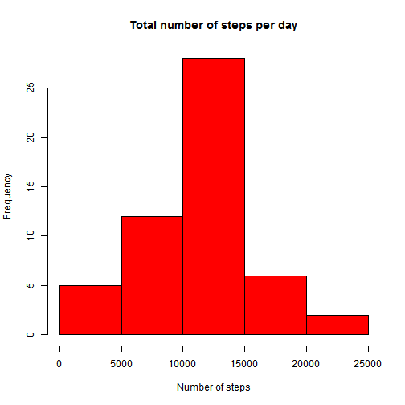

# Peer graded assignment

Loading packages and data:

```r
#setwd("D:/Trabajo (3)/Métodos/R courses/Curso 5 DSE - Reproducible research/PGA1")
library(ggplot2)
furl <- "https://github.com/wilsonhb/RepData_PeerAssessment1/raw/master/activity.zip"
if(!file.exists("activity.zip")) {
      download.file(furl, destfile = "./activity.zip", mode="wb")
      unzip("activity.zip", overwrite = T)
}
da <- read.csv("D:/Trabajo (3)/Métodos/R courses/Curso 5 DSE - Reproducible research/PGA1/activity.csv", header = T)
```

# 1. What is the mean total number of steps taken per day?
Creates an object containing the collapse dataset:

```r
steps_day <- aggregate(steps ~ date, da, sum)
```

Creates the histogram:

```r
hist (steps_day$steps, main="Total number of steps per day", col="red", xlab="Number of steps")
```



```r
ggsave("./figures/plot1.png")
```

```
## Saving 7 x 7 in image
```

Reporting the mean and median:

```r
mean(steps_day$steps)
```

```
## [1] 10766.19
```

```r
median(steps_day$steps)
```

```
## [1] 10765
```


#2. What is the average daily activity pattern?
Making the time series plot for 5-minute interval

```r
steps_interval <- aggregate(steps ~ interval, da, mean)
g <- ggplot(data = steps_interval, aes(interval, steps))
g + geom_line() +
      labs(x="5-minute interval", y = "Steps (mean)") +
      labs(title = "Daily activity pattern") +
      theme_minimal()
```


```r
ggsave("./figures/plot2.png")
```

```
## Saving 7 x 7 in image
```

The interval with the maximum of steps is:

```r
max_interval <- steps_interval[which.max(steps_interval$steps), 1]
max_interval
```

```
## [1] 835
```

# 3. Imputing missing values
Calculate and report the total number of missing values in the dataset

##Total missing values:

```r
na <- sum(!complete.cases(da))
na
```

```
## [1] 2304
```

##Imputing missing values for NA:

```r
da$steps[is.na(da$steps) == T] <- mean(da$steps, na.rm = T)
sum(is.na(da$steps))
```

```
## [1] 0
```

## Replicate histogram for daily steps with no NA

```r
da2 <- aggregate(steps ~ date, da, sum)
g <- ggplot(data = da2, aes(steps))
g + geom_histogram(bins = 30, col="green") +
      labs("Histogram of daily steps with no NA")
```


```r
hist (da2$steps, main="Total number of steps per day", col="orange", xlab="Number of steps")
```


```r
ggsave("./figures/plot3.png")
```

```
## Saving 7 x 7 in image
```

# 4. Are there differences in activity patterns between weekdays and weekends?

```r
library(timeDate)
#da <- read.csv("activity.csv", header = T)
#da$steps[is.na(da$steps) == T] <- mean(da$steps, na.rm = T)
da$ww2 <- isWeekday(da$date)
table (da$ww2)
```

```
## 
## FALSE  TRUE 
##  4608 12960
```

```r
library(lattice)
da2 <- aggregate(steps ~ interval + ww2, da, mean)
with(da2, xyplot(steps ~ interval | ww2, type="l", layout=c(1,2)))
```


```r
#
g <- ggplot(da2, aes(interval, steps, color = ww2))
g + facet_wrap(.~ww2, ncol=1, nrow=2) +
      geom_line() +
      labs(x = "Interval", y= "Average number of steps") +
      labs(title = "Average daily steps during weekend/weekdays") +
      scale_colour_discrete(name="Days", labels=c("Weekend", "Weekdays"))
```


```r
ggsave("./figures/plot4.png")
```

```
## Saving 7 x 7 in image
```
      

```r
library(knitr)
knit(input="PA1_template.rmd", output = "PA1_template.md")
```

```
## 
## 
## processing file: PA1_template.rmd
```

```
## Error in parse_block(g[-1], g[1], params.src, markdown_mode): Duplicate chunk label 'setup', which has been used for the chunk:
## #setwd("D:/Trabajo (3)/Métodos/R courses/Curso 5 DSE - Reproducible research/PGA1")
## library(ggplot2)
## furl <- "https://github.com/wilsonhb/RepData_PeerAssessment1/raw/master/activity.zip"
## if(!file.exists("activity.zip")) {
##       download.file(furl, destfile = "./activity.zip", mode="wb")
##       unzip("activity.zip", overwrite = T)
## }
## da <- read.csv("D:/Trabajo (3)/Métodos/R courses/Curso 5 DSE - Reproducible research/PGA1/activity.csv", header = T)
```
